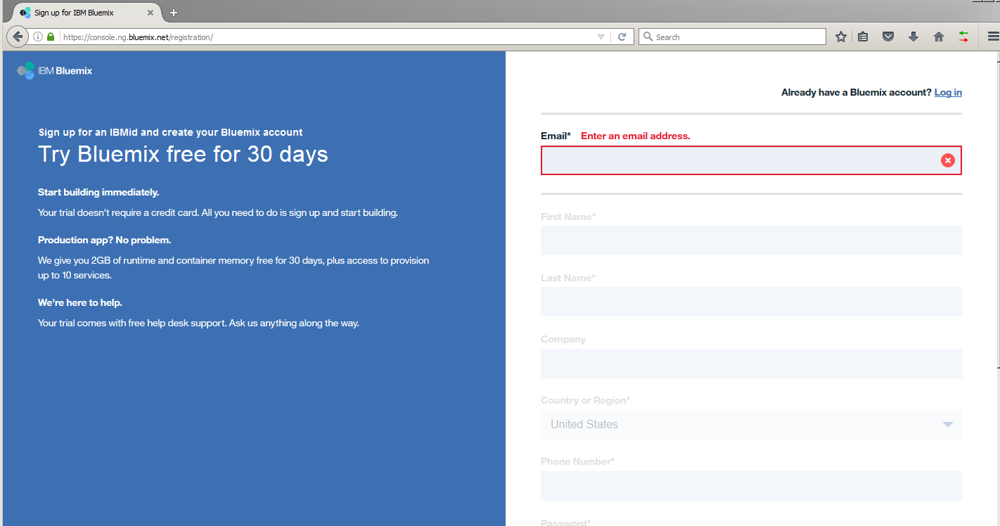
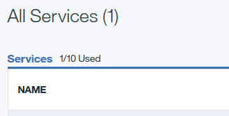
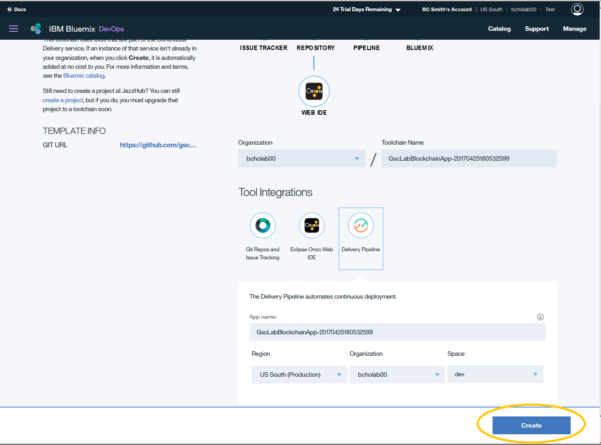

# IBM Blockchain - Open Points Application

Welcome! These instructions describe the prerequisites you should complete before attending the lab session. Please follow these steps to ensure that you are fully 
prepared to participate on the day of the lab.

<b>IMPORTANT NOTICE: This lab relies on Bluemix and services such as Blockchain and Node JS. It may not work exactly as documented when Bluemix and/or the underlying services are updated. Please contact us if you experience problems with the lab. The lab documents were last updated on April 24th of 2017, and the Bluemix service functionality was last validated on April 24th of 2017. 
</b>

<b>Disclaimer: The code provided in this lab exercise is for educational purpose only.  It is not production level code and may not follow best practices. </b>

## Prepare your Bluemix account

<b>1. Ensure that you have an account on [IBM Bluemix](https://bluemix.net). (If you already have an account, you can proceed to step 2 in this section). </b>

  1.1 Register for a [Bluemix account](https://bluemix.net/registration/), fill out the required details and click 'Create Account'.

&nbsp;&nbsp;&nbsp;&nbsp;&nbsp;&nbsp;&nbsp;&nbsp;&nbsp;&nbsp;&nbsp;&nbsp; 

   You will receive a message to check your email.

&nbsp;&nbsp;&nbsp;&nbsp;&nbsp;&nbsp;&nbsp;&nbsp;&nbsp;&nbsp;&nbsp;&nbsp; 

   1.2 Please check your email and look for a registration confirmation email from Bluemix.

&nbsp;&nbsp;&nbsp;&nbsp;&nbsp;&nbsp;&nbsp;&nbsp;&nbsp;&nbsp;&nbsp;&nbsp; 

   1.3 Click on 'Confirm your account' and receive a 'Success' message.

&nbsp;&nbsp;&nbsp;&nbsp;&nbsp;&nbsp;&nbsp;&nbsp;&nbsp;&nbsp;&nbsp;&nbsp;  

   1.4 Click 'Login' and login with your Bluemix credentials.

&nbsp;&nbsp;&nbsp;&nbsp;&nbsp;&nbsp;&nbsp;&nbsp;&nbsp;&nbsp;&nbsp;&nbsp;  
   

   1.5 Create an Organization and enter any organization name.

&nbsp;&nbsp;&nbsp;&nbsp;&nbsp;&nbsp;&nbsp;&nbsp;&nbsp;&nbsp;&nbsp;&nbsp; 

   1.6 Create a Space and enter a space name. You can also choose the default space name of 'dev'.

&nbsp;&nbsp;&nbsp;&nbsp;&nbsp;&nbsp;&nbsp;&nbsp;&nbsp;&nbsp;&nbsp;&nbsp; 
   

   1.7 After you receive a success message, please click 'I'm Ready'

&nbsp;&nbsp;&nbsp;&nbsp;&nbsp;&nbsp;&nbsp;&nbsp;&nbsp;&nbsp;&nbsp;&nbsp; 
 
<b>
 You will land on your Bluemix Dashboard. 
</b>

&nbsp;&nbsp;&nbsp;&nbsp;&nbsp;&nbsp;&nbsp;&nbsp;&nbsp;&nbsp;&nbsp;&nbsp; 

<b> 2. Ensure that you have the necessary space available in your Bluemix account to complete the lab. During the lab, you will be required to deploy 1 application and 2 services.  If you use a new Bluemix account, you should be good to go.  If you use an existing Bluemix account, you can go to your Bluemix Dashboard to check if you have the required space: </b>
  
   * The 'All Apps' Section shows the memory you have available for apps. You will require at least 512MB of free space to deploy an app during the lab. If you do not have 512MB of free space, then delete some existing apps (visible in your dashboard) before proceeding to the next step.

&nbsp;&nbsp;&nbsp;&nbsp;&nbsp;&nbsp;&nbsp;&nbsp;&nbsp;&nbsp;&nbsp;&nbsp;

   * The 'All Services' Section shows the number of services you have available. You will require space to deploy two services during the lab. If you do not have sufficient space for two services, then delete some existing services (visible in your dashboard) before proceeding to the next step. 

&nbsp;&nbsp;&nbsp;&nbsp;&nbsp;&nbsp;&nbsp;&nbsp;&nbsp;&nbsp;&nbsp;&nbsp;

## Deploy the App

<b>1. Right-Click (and "Open Link in New Tab") on the 'Deploy to Bluemix' button shown below. 
(NOTE: The button is located on this VERY webpage right below this bullet item - do NOT look for it within your bluemix account!).</b>

&nbsp;&nbsp;&nbsp;&nbsp;&nbsp;&nbsp;&nbsp;&nbsp;&nbsp;&nbsp;&nbsp;&nbsp; 

<b>2. On your new browser tab, log in with your Bluemix account, if you are not already logged in.</b>

&nbsp;&nbsp;&nbsp;&nbsp;&nbsp;&nbsp;&nbsp;&nbsp;&nbsp;&nbsp;&nbsp;&nbsp; 

<b>3. If you are asked to choose an alias, then follow these instructions. Otherwise, proceed to step 4 in this section. </b>

3.1 Enter a unique alias name and click create.
&nbsp;&nbsp;&nbsp;&nbsp;&nbsp;&nbsp;&nbsp;&nbsp;&nbsp;&nbsp;&nbsp;&nbsp; 

3.2 Verify your alias name and click continue. 
&nbsp;&nbsp;&nbsp;&nbsp;&nbsp;&nbsp;&nbsp;&nbsp;&nbsp;&nbsp;&nbsp;&nbsp; 

<b>4. Click on 'Delivery Pipeline' to verify the pipeline parameters.

&nbsp;&nbsp;&nbsp;&nbsp;&nbsp;&nbsp;&nbsp;&nbsp;&nbsp;&nbsp;&nbsp;&nbsp; 

Leave the default app name that Bluemix chooses as is. You may modify the default Organization 
and Space if you would like the app deployed to a specific area of your Bluemix account. Otherwise, accept the default values
and click 'Create'.</b>

&nbsp;&nbsp;&nbsp;&nbsp;&nbsp;&nbsp;&nbsp;&nbsp;&nbsp;&nbsp;&nbsp;&nbsp; 

* The status of the deployment (creating a toolchain) is shown. This can take approximately 1-3 minutes to complete.  
* Once the toolchain is created/ready (A greencheck appears at the top).  Click on Delivery Pipeline tile to see status of deployment to Bluemix.

&nbsp;&nbsp;&nbsp;&nbsp;&nbsp;&nbsp;&nbsp;&nbsp;&nbsp;&nbsp;&nbsp;&nbsp;

* The status of the deployment (deploying to Bluemix) is shown. This can take approximately 10-15 minutes to complete.

&nbsp;&nbsp;&nbsp;&nbsp;&nbsp;&nbsp;&nbsp;&nbsp;&nbsp;&nbsp;&nbsp;&nbsp;

* The deployment process performs the following actions:
  - Creates a Node JS application
  - Creates a blockchain service

<b>5. After the deployment has completed, click on the menu icon 'Hamburger icon' on the upper left corner. </b>

&nbsp;&nbsp;&nbsp;&nbsp;&nbsp;&nbsp;&nbsp;&nbsp;&nbsp;&nbsp;&nbsp;&nbsp;

Click on Apps and then Dashboard. 

&nbsp;&nbsp;&nbsp;&nbsp;&nbsp;&nbsp;&nbsp;&nbsp;&nbsp;&nbsp;&nbsp;&nbsp;

You will land on the Bluemix Apps Dashboard. (It may take a few minutes for the OpenPointsBlockchainService to show up.) 

&nbsp;&nbsp;&nbsp;&nbsp;&nbsp;&nbsp;&nbsp;&nbsp;&nbsp;&nbsp;&nbsp;&nbsp;

<b>6. Click on the blockchain service row.</b>

&nbsp;&nbsp;&nbsp;&nbsp;&nbsp;&nbsp;&nbsp;&nbsp;&nbsp;&nbsp;&nbsp;&nbsp;

You will land on the Overview page of the blockchain service, which should appear similar to the one shown below.  

&nbsp;&nbsp;&nbsp;&nbsp;&nbsp;&nbsp;&nbsp;&nbsp;&nbsp;&nbsp;&nbsp;&nbsp;

<b>7. The application and services have been successfully deployed, and you are now ready to begin the lab!</b>

Download the [lab handout](https://ibm.biz/XXX) to begin the lab. 

# Troubleshooting

<b>If you encounter these errors during deployment, try these resolutions.</b>
&nbsp;&nbsp;&nbsp;&nbsp;&nbsp;&nbsp;&nbsp;&nbsp;&nbsp;&nbsp;&nbsp;&nbsp;

<b>If you receive the error message shown below that the network is over capacity, then the service was not created. 
Please delete the blockchain service and the lab application, and repeat the deployment steps listed above until a blockchain
service can be successfully created. </b>

&nbsp;&nbsp;&nbsp;&nbsp;&nbsp;&nbsp;&nbsp;&nbsp;&nbsp;&nbsp;&nbsp;&nbsp;

<b>Deleting the service.</b>
&nbsp;&nbsp;&nbsp;&nbsp;&nbsp;&nbsp;&nbsp;&nbsp;&nbsp;&nbsp;&nbsp;&nbsp;

<b>Deleting the application.</b>
&nbsp;&nbsp;&nbsp;&nbsp;&nbsp;&nbsp;&nbsp;&nbsp;&nbsp;&nbsp;&nbsp;&nbsp;

# License

  This sample code is licensed under Apache 2.0.
  Full license text is available in [LICENSE](LICENSE).

## Open Source @ IBM

  Find more open source projects on the
  [IBM Github Page](http://ibm.github.io/).

